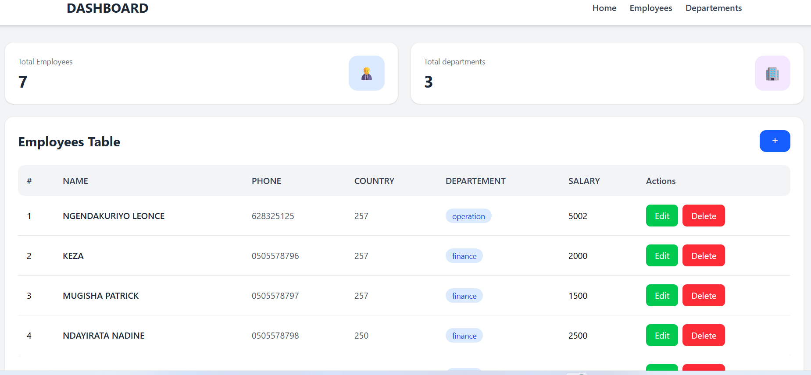
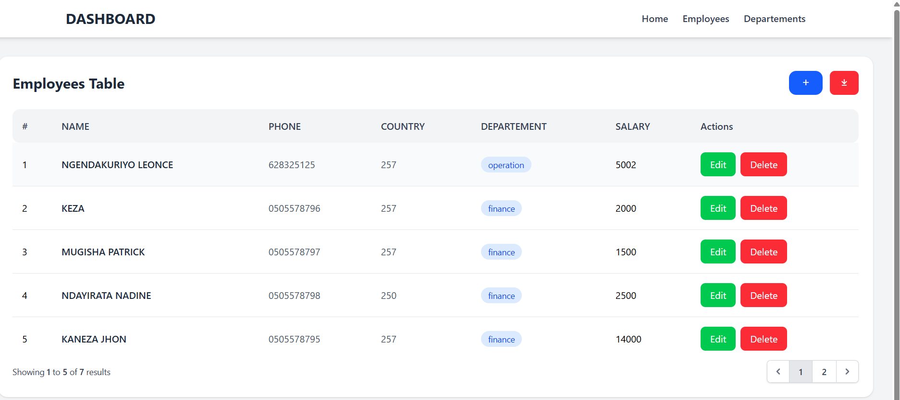
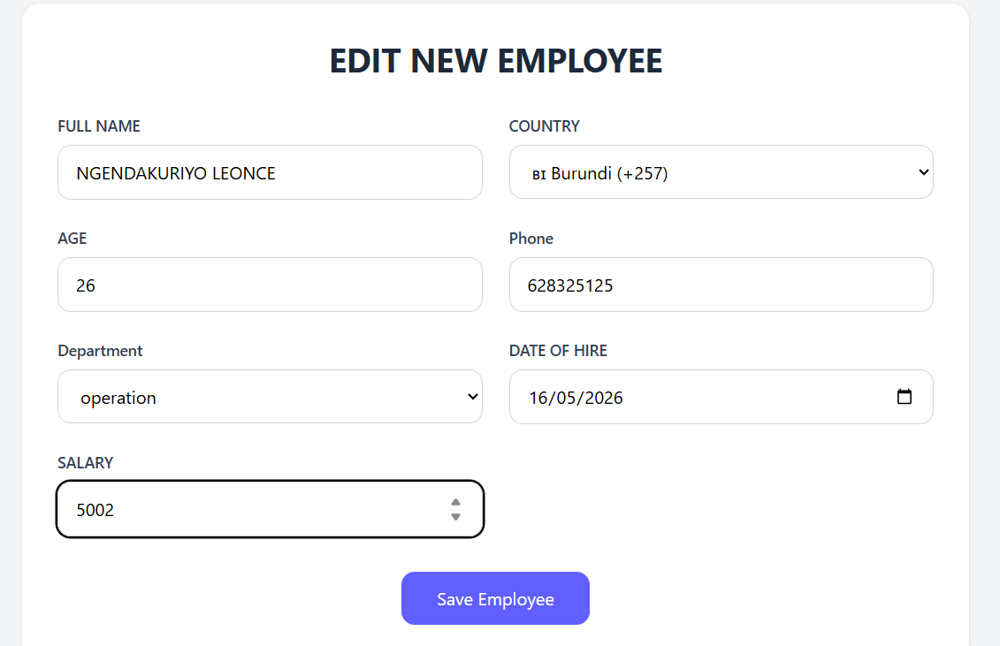
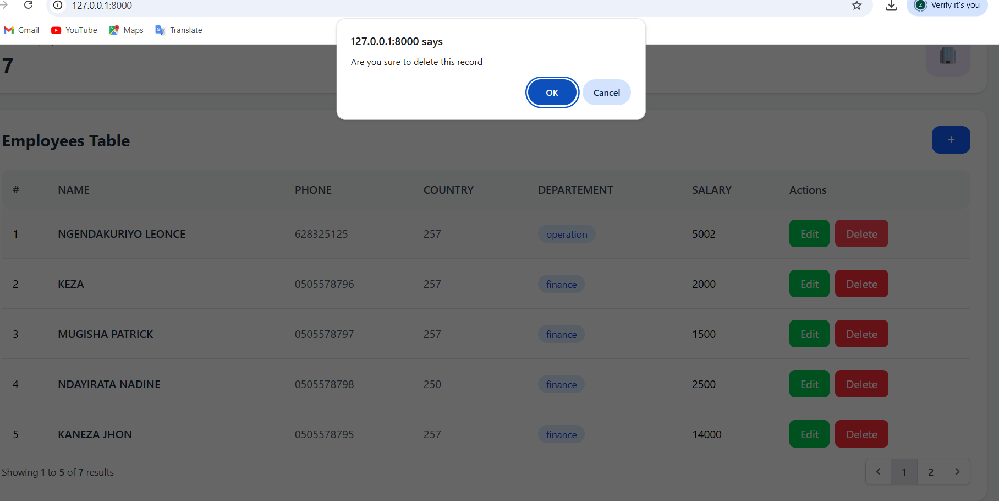
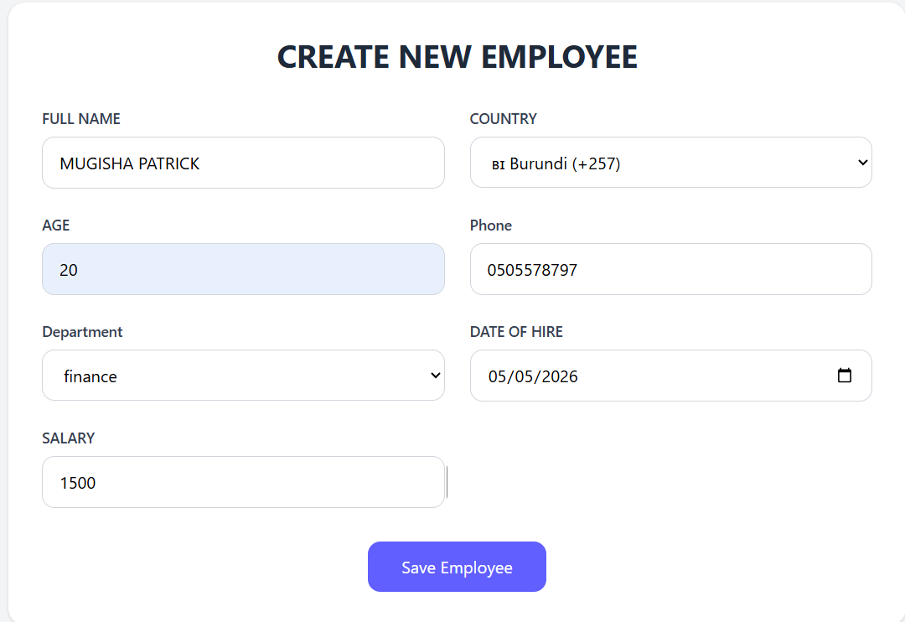
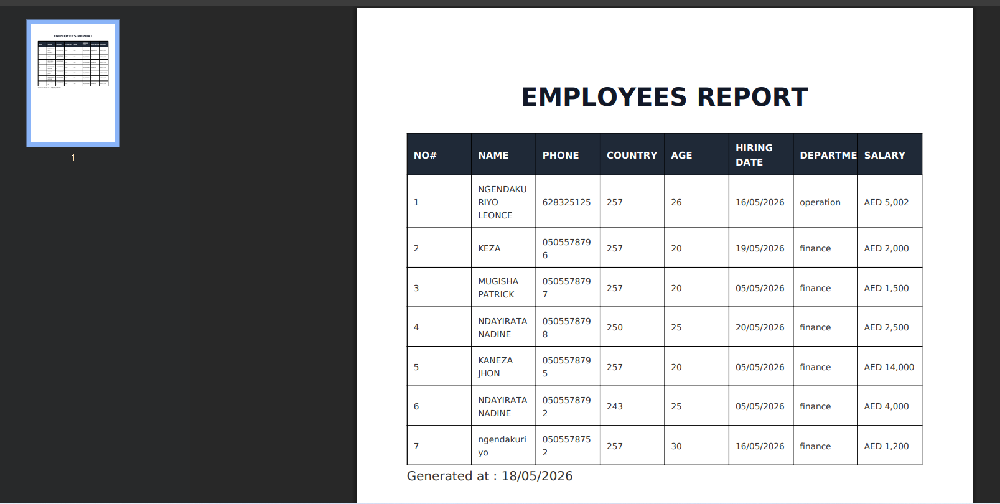
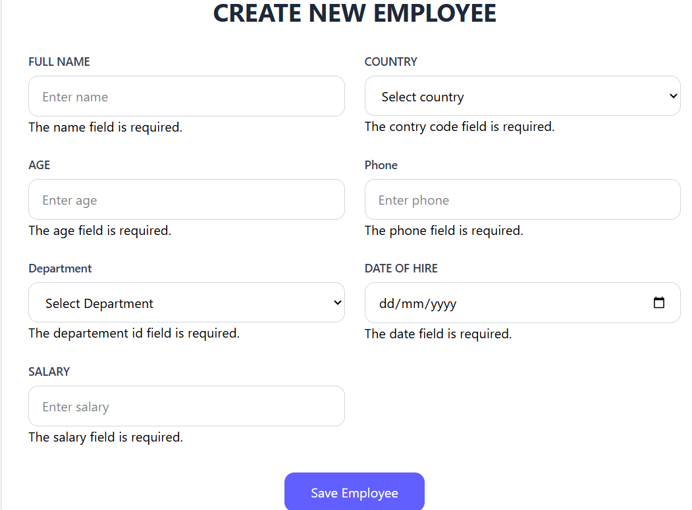

# Employee Management System

Simple CRUD application built with Laravel.

## Features

- Create Employee
- Update Employee
- Delete Employee
- Employee PDF Export
- Pagination
- Department Management
- Validation

## Technologies Used

- Laravel
- MySQL
- Tailwind CSS
- DomPDF

## Installation

Clone project:

```bash
git clone https://github.com/ngendakuriyoleonce/project.git
```

Go to project:

```bash
cd CRUD
```

Install dependencies:

```bash
composer install
```

Install PDF package

```bash
composer require barryvdh/laravel-dompdf
```

Install Node dependencies

```bash
npm install
```

Copy environment file:

```bash
cp .env.example .env
```

Generate app key:

```bash
php artisan key:generate
```

Configure database in `.env`
DB_DATABASE=employee_management
DB_USERNAME=root
DB_PASSWORD=


```bash
php artisan migrate
```

Start server:

```bash
php artisan serve
```

## Screenshots

### Dashboard


### Employees


### edit Employee


### delete Employee


### create Employee



### PDF Report


### Validation datas



## Author

NGENDAKURIYO LEONCE
